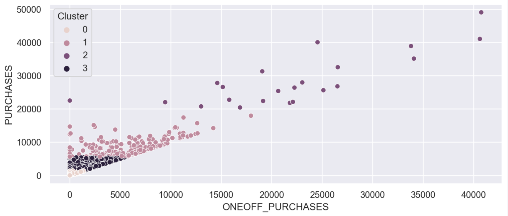

# Credit Card Segmentation

## Table of Contents
- [Project Overview](#project-overview)
- [Data Source](#data-source)
- [Website Link](#website-link)
- [Implementation Details](#implementation-details)
    - [Methods Used](#methods-used)
    - [Technologies](#technologies)
    - [Python Packages Used](#python-packages-used)
- [Steps Followed](#steps-followed)
- [Results](#results)
- [Future Improvements](#future-improvements)

## Project Overview
In this project, customer segmentation was conducted for credit card customers. The primary objective of this analysis was to divide the customer base into distinct segments based on specific characteristics. 

This segmentation enables businesses to gain valuable insights about their customers, which can be utilized to develop targeted marketing strategies and enhance overall business performance. 

## Data Source
The dataset used for this project can be obtained from [here](https://www.kaggle.com/datasets/arjunbhasin2013/ccdata).

The dataset summarizes the usage behavior of about 9000 active credit card holders for 6 months. 

## Website Link

A web-based demonstration of this project can be accessed [here](https://credit-card-segmentation.streamlit.app).

## Implementation Details

### Methods Used
* Machine Learning - Unsupervised
* Data Visualization
* Customer Segmentation

### Technologies
* Python
* Jupyter
* streamlit

### Python Packages Used
* Data Manipulation: Pandas, numpy
* Data Visualization: seaborn, matplotlib
* Machine Learning: scikit
  
## Steps Followed

1. **Data collection**: Obtained the customer credit card dataset from Source Dataset Link.
2. **Data Preprocessing**: Cleansed the data, addressed skewness, and performed dimensionality reduction.
4. **Model Development**: Traied the model using KMeans. Multiple iterations are conducted using different numbers of clusters to explore various segmentation possibilities.
5. **Model Evaluation**: To determine the optimal number of clusters, an evaluation technique such as the elbow method is used. 
6. **Deployment**: The Credit Card Segmentation model is deployed as a standalone application. This enables users to interact with the model and visualize the data based on the identified clusters. The deployed app provides an intuitive interface with features such as column distribution analysis, scatter plots showcasing relationships between variables.

## Results

Optimal number of clusters is found to be 4.

## Future Improvements

While K-means is a commonly used clustering algorithm, exploring and implementing more advanced algorithms can be beneficial. Algorithms such as hierarchical clustering, DBSCAN, or spectral clustering may offer better performance and more accurate segmentation results.

